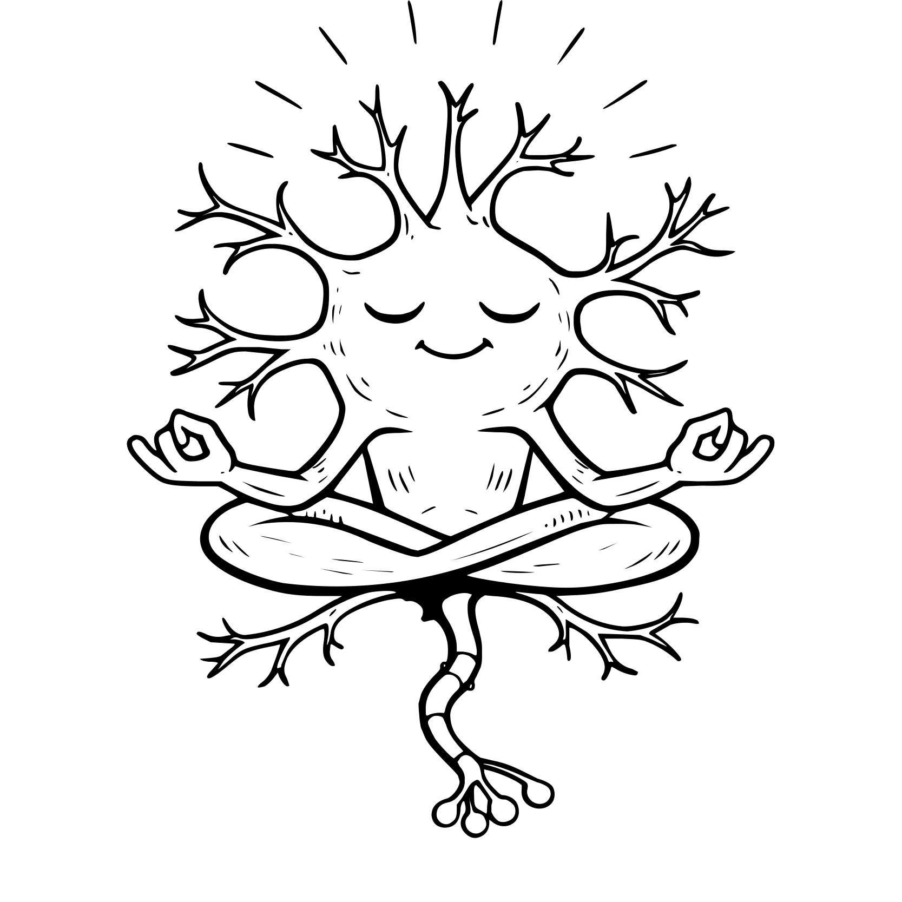

# Zendrite

Zendrite is a second-generation Matrix homeserver written in Go, designed to be efficient, reliable, and scalable.

> Forked from [element-hq/dendrite](https://github.com/element-hq/dendrite) in February 2026

The existing Dendrite Matrix rooms are used for chatting:

-  for general project discussion and support
-  for chat about development specifically

## Getting Started

See the [documentation site](https://zendrite.pat-s.me) for installation, administration, and development guides.

## Downloads

- **Container images:**
  - [Docker Hub](https://hub.docker.com/r/pats22/zendrite)
  - [Codefloe Registry](https://codefloe.com/pat-s/-/packages/container/pat-s/zendrite)
- **Binaries:** [Releases](https://codefloe.com/pat-s/zendrite/releases)

The first public release of this fork is v0.15.3.

## Migrating from Dendrite

If you are upgrading from an existing Dendrite installation, see the [migration guide](https://zendrite.pat-s.me/administration/migration-from-dendrite/) for details on config, API endpoint, and JetStream changes.

## License

Copyright 2017 OpenMarket Ltd  
Copyright 2017 Vector Creations Ltd  
Copyright 2017-2025 New Vector Ltd

This software is dual-licensed by New Vector Ltd (Element):

1. [GNU AGPL v3](https://www.gnu.org/licenses/agpl-3.0.html) (or later); or
2. A paid-for Element Commercial License (terms may vary).
